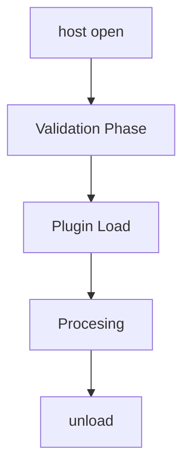
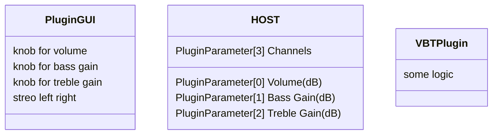
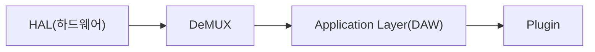
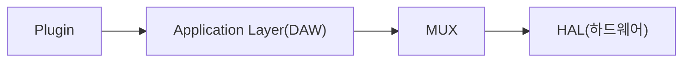
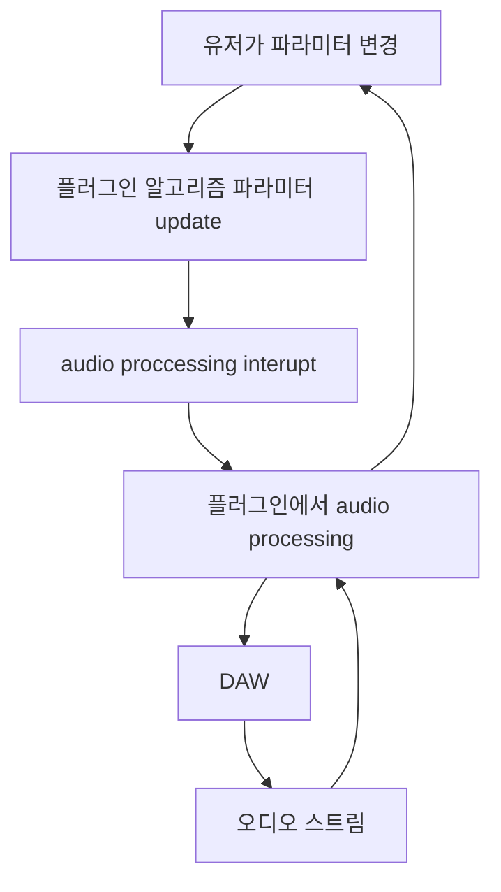

### 플러그인 packaging: DLLs(Dynamic-Link Libraries)

모든 플러그인은 DLLs 로 패키징된다 (dynamic-linked, dynamically linked) DLL은 공유 라이브러리의 MS-specific 한 용어로 시작되어, 지금에서는 미리 컴파일되어 실행가능한 링크를 가지고 있는 라이브러리를 총칭하는 용어가 됨

**Static-link libraries**
C++ 컴파일러는 precomplied 된 함수들의 라이브러리를 많이 포함하고 있음 (math 라이브러리 등) sin() 등의 method 를 `#include <Math.h>` 없이 사용하려고 한다면, `sin() is not defined` 의 오류가 나는걸 볼 수 있음

함수를 호출하게 되면 link 된 라이브러리의 코드를 가져와서 지금 작성하는 프로그램의 executable 에 포함시킨 다음 컴파일을 수행하게 됨

**Dynamic link libraries**
함수를 호출하면 미리 컴파일된 executable 파일을 실행해서 결과를 return 받아옴

**host(DAW) 에서 plugin 을 호출하는 과정**

**host open**
호스트 (DAW) 가 open 되면, 특정 경로에 있는 파일을 탐색해서 plugin 을 load 할 준비를 함

**validation phase**
플러그인이 DAW의 standard 에 적합한지 validation
성공할 경우 Plugin 을 load 함

**Processing**
플러그인이 validation에 성공한 후 load 된 다음 host로부터 오디오 시그널을 받아서 오디오 시그널 프로세싱을 진행함

### The Plugin Description: Simple Strings

API 마다 조금씩 다른 방법으로 host 가 플러그인의 정보를 알 수 있도록 함

| plugin name                 |                          |
| --------------------------- | ------------------------ |
| plugin short name           | AAX only                 |
| plugin type                 | synth or FX, API 에 따라 다름 |
| vender                      |                          |
| vender email or website URL |                          |

**The Plugin Description: Features and Options**
load time 에 정의되어야 할 정보가 필요함 (host 에 전달)
* side-chain input
* latency (delay) in the signal processing
* reverb or delay "tail" after playback is stopped and needs to inform the host that it wants to include this reverb tail; the plugin sets the tail time for the host
* plugin has a custom GUI that it wants to display for the user
* plugin wants to show a Pro Tools gain reduction meter (AAX)
* plugin factory presets

### Initialization: Defining the Plugin Parameter Interface

플러그인 파라미터가 expose 되어야 할 이유
* 유저가 parameter automation 이 포함된 DAW 세션을 만들면 host 가 playback 중 파라미터가 어떻게 alter 되어야 할 지 알아야 함
* GUI 가 없다고 가정하면 daw 에서 간단한 gui 를 제공해 주는데 이때 파라미터 정보가 필요함
* 유저가 DAW 세션을 저장하면, parameter state 가 저장되어야한다

플러그인 예시 `VBT`
`volume` `bass boost/cut` `treble boost/cut` `channel I/O left, right, stereo` 가 있는 `VBT` 라는 플러그인이 있다고 가정

volume, bass gain, treble gain 의 continuous parameter, channel I/o 의 string-list 두 종류의 파라미터가 존재함
continuous paramaters는 보통 knobs, sliders 에 연결되며, `float` `double` `int` data types 를 사용
string-list 는 drop-down 또는 스위치 등의 GUI 로 제공됨

parameter attributes 가 포함하고 있는것
* 파라미터 이름(volume)
* 파라미터 unit (dB)
* numerical value, list of string values 또는 스트링 리스트인 경우 strings
* 파라미터의 최소값, 최댓값
* default value
* control taper information (linear, logarithmic, etc)
* 다른 API 종속적인 정보
* auxiliary information

**Initialization: Defining Channel I/O Support**
mono in/mono out, mono in/stereo out, stereo in/stereo out 등의 채널 support 가 필요함

**Initialization: Sample Rate Dependency**
the plugin retrieves the sample rate from a function call or an API member variable

### Processing: Preparing for Audio Streaming
플러그인 자체에서 오디오 streaming session 을 준비해야함 (알고리즘 리셋, 오래된 데이터 정리, buffer 정리 등등)
API 에서 보통 함수를 제공 (prior to audio streaming)

**Processing: Audio Signal Processing (DSP)**
Ultimately the effects plugin must process audio information, transforming it in some way. the audio data come either from audio files loaded into a session, or from real-time audio streamming into the audio adaptor

하드웨어에서 인풋을 받아 daw 에서 처리한 다음, plugin으로 전달

plugin에서 처리한 다음, DAW 로 전달 후 하드웨어 레이어에서 스피커로 output

스테레오 데이터의 경우, left channel, left, right succession 의 순서로 전달됨(교차 전달, interleaves)

DAW 가 교차로 전달된 데이터를 de-interleaves 한 뒤, 각 채널(오른쪽, 왼쪽)를 각자의 buffer 에 넣어줌 (`input channel buffer`) 그리고 DAW가 플러그인이 작성한 processed audio data를 저장하기 위한 새로운 버퍼를 또 만들어줌(`output channel buffers`) 

(스테레오 기준)
DAW 가 플러그인으로 보내는 데이터
* 각 버퍼의 포인터 주소
* 각 버퍼의 길이
* left input, right input, left output, right output 버퍼의 정보 (주소, 길이)
* 두 input 버퍼의 경우 two-slot array 의 형태로 플러그인으로 전달됨

플러그인이 오디오 정보를 처리한 뒤, 포인터를 return 할 때, DAW가 re-interleaves 를 한 뒤에 하드웨어 레이어로 전달함 또는 파일에 작성함

**processing the buffers**
* 각 버퍼를 따로 처리하는 방법 (buffer processing)
* 샘플 하나씩 processing (frame processing)

### Mixing Parameter Changes With Audio Processing

오디오를 프로세싱하는 동시에 파라미터 변경을 처리해야함

버퍼 프로세싱 cycle
* Pre-processing
	* 플러그인에 파라미터 change 정보 전달
* Processing
	* DSP operation 수행
* Post-processing
	* 파라미터 정보를 GUI 에 전달, GUI update
	* MIDI output 있는 경우, MIDI message 생성
