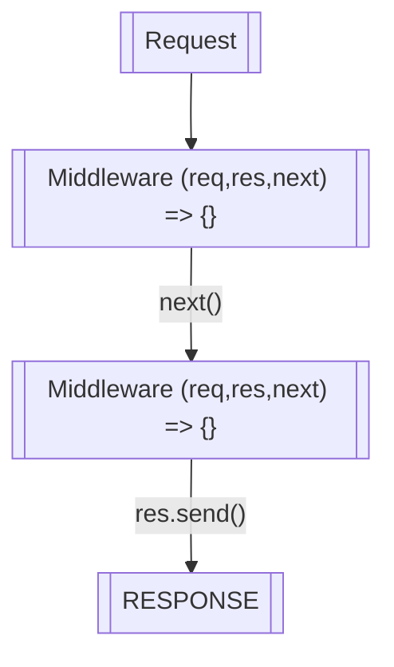

### express 와 http 모듈을 이용해서 서버 열기

패키지 설치
``` bash
npm install --save express
npm install -D @types/express
```

``` typescript
import express from "express";
import http from "http";

const app = express();
const server = http.createServer(app);

server.listen(3000);
```

### middleware



요청이 들어오면 "미들웨어"라 불리는 함수를 통해 특정 동작을 수행하게 할 수 있다 (`app.use()` 함수로 가능)

``` typescript
// middleware 예시
import express from "express";
import http from "http";

const app = express();
const server = http.createServer(app);

app.use((req, res, next) => {
  console.log("SOME MIDDLEWARE");
  console.log(req.hostname);

  next();
});

app.use((req, res, next) => {
  console.log("another middleware");
  res.send("<h1>HELLO</h1>");
});

server.listen(3000);
```

### http 모듈 제거

`const server = http.createServer(app);` 과
`server.listen(3000)` 을
`app.listen(3000)` 한 줄로 변경할 수 있다

``` typescript
import express from "express";

const app = express();

app.use((req, res, next) => {
  console.log("SOME MIDDLEWARE");
  console.log(req.hostname);

  next();
});

app.use((req, res, next) => {
  console.log("another middleware");
  res.send("<h1>HELLO</h1>");
});

app.listen(3000);
```

### routing

app.use() 함수를 통해서 구현 가능함
``` typescript
import express from "express";

const app = express();

app.use("/", (_req, _res, next) => {
  console.log("MIDDLEWARE");
  next();
});

// "/something" 으로 시작하는 모든 경로에 대해 작동, /something/a /something/asdf 등에서 작동하는 함수
app.use("/something", (_req, res, _next) => {
  res.send("<h1>SOMETHING</h1>");
});

// "/" 로 시작하는 모든 경로에 대해 작동, 이 함수 전에 app.use("/something") 이 먼저 실행되므로, /something 을 제외한 모든 경로에 대해 작동하는 함수
app.use("/", (_req, res, _next) => {
  res.send("<h1>HELLO</h1>");
});

app.listen(3000);
```

### POST request

``` typescript
import express from "express";
import bodyParser from "body-parser";

const app = express();

// body-parser middleware 적용, /product 라우트에 들어온 데이터를 파싱해 주는 역할을 수행함 (여기서는 form action 관련 데이터, json 등 을 파싱하려면 다른 패키지가 필요)
app.use(bodyParser.urlencoded());

// /add-product 라우트에서 form 을 이용해서 POST request 를 만듦
app.use("/add-product", (_req, res, _next) => {
  res.send(
    `<html>
      <body>
        <h3>ADD-PRODUCT</h3>
        <form action="/product" method="POST">
          <input type="text" name="title" />
          <button type="submit">Add product</button>
        </form>
      </body>
    </html>`
  );
});

app.use("/product", (req, res, _next) => {
  console.log(req.body);

  res.redirect("/");
});

app.use("/", (_req, res, _next) => {
  res.send("<h1>HELLO</h1>");
});

app.listen(3000);
```

지금 `/product` 라우트에서 POST 리퀘스트 뿐 아니라 GET request 등의 요청도 받아주고 있는데 POST req 만 가능하도록 강제하는 방법이 필요함

``` typescript
app.post("/product", (req, res, _next) => {
  console.log(req.body);

  res.redirect("/");
});
```

`app.use()` 함수에서 `app.post()` 함수로 변경하면 post method 일 때만 실행 가능하게 할 수 있음

[app.METHOD](https://expressjs.com/en/4x/api.html#app.METHOD) 

### 파일분리 (`express.Router()`)

``` typescript
// src/routes/admin.ts
import express from "express";

const adminRouter = express.Router();

adminRouter.get("/add-product", (_req, res, _next) => {
  res.send(
    `<html>
      <body>
        <h3>ADD-PRODUCT</h3>
        <form action="/add-product" method="POST">
          <input type="text" name="title" />
          <button type="submit">Add product</button>
        </form>
      </body>
    </html>`
  );
});

adminRouter.post("/add-product", (req, res, _next) => {
  console.log(req.body);

  res.redirect("/");
});

export default adminRouter;
```

``` typescript
// src/routes/shop.ts
import express from "express";

const shopRouter = express.Router();

// router.use 와는 다르게 router.use 메서드는 "/" 경로에 exact matching 일 때만 작동함
shopRouter.get("/", (_req, res, _next) => {
  res.send("<h1>HELLO</h1>");
});

export default shopRouter;
```

``` typescript
// src/index.ts
import express from "express";
import bodyParser from "body-parser";
import adminRouter from "./routes/admin";
import shopRouter from "./routes/shop";

const app = express();

app.use(bodyParser.urlencoded());

// routes
app.use(adminRouter);
app.use(shopRouter);

app.listen(3000);
```

### `404 not found error` 라우터 추가

``` typescript
// src/index.ts

import express from "express";
import bodyParser from "body-parser";
import adminRouter from "./routes/admin";
import shopRouter from "./routes/shop";

const app = express();

app.use(bodyParser.urlencoded());

// routes
app.use(adminRouter);
app.use(shopRouter);

// 404 error
// "/" 라우트 생략가능함.
app.use((_req, res, _next) => {
  res.status(404).send("<h1>Page Not Found</h1>");
});

app.listen(3000);
```

### 경로 필터링

`app.use(MY_ROUTE)` 함수에서 선행되는 경로를 추가 할 수 있음

``` typescript
const someRouter = express.Router();

someRouter.get("/someRoute", () => {});

// someRouter 의 모든 라우트에 /my_route 가 붙는다. /my_route/someRoute 형식으로 바뀜.
app.use("/my_route", someRouter);
```

``` typescript
// src/index.ts

import express from "express";
import bodyParser from "body-parser";
import adminRouter from "./routes/admin";
import shopRouter from "./routes/shop";

const app = express();

app.use(bodyParser.urlencoded());

// routes
// adminRouter 에 선행되는 /admin 을 추가했음. 기존에 작성했던 /add-product 라우트는 이제 /admin/add-product 로 접근 가능
app.use("/admin", adminRouter);
app.use(shopRouter);

// 404 error
app.use((_req, res, _next) => {
  res.status(404).send("<h1>Page Not Found</h1>");
});

app.listen(3000);
```

``` typescript
// src/routes/admin.ts

import express from "express";

const adminRouter = express.Router();

adminRouter.get("/add-product", (_req, res, _next) => {
  // form 필드에서 action의 주소를 변경함 (/add-product -> /admin/add-product).
  res.send(
    `<html>
      <body>
        <h3>ADD-PRODUCT</h3>
        <form action="/admin/add-product" method="POST">
          <input type="text" name="title" />
          <button type="submit">Add product</button>
        </form>
      </body>
    </html>`
  );
});

adminRouter.post("/add-product", (req, res, _next) => {
  console.log(req.body);

  res.redirect("/");
});

export default adminRouter;
```

### html page service 하기

`html` 파일 작성

``` html
// views/add-product.html
<!DOCTYPE html>
<html lang="en">
<head>
  <meta charset="UTF-8">
  <meta name="viewport" content="width=device-width, initial-scale=1.0">
  <title>ADD PRODUCT</title>
</head>
<body>
  <header>
    <nav>
      <ul>
        <li><a href="/">Shop</a></li>
        <li><a href="/add-product">Add Product</a></li>
      </ul>
    </nav>
  </header>

  <main>
    <form action="/admin/add-product" method="POST">
      <input type="text" name="title"/>
      <button type="submit">Add Product</button>
    </form>
  </main>
</body>
</html>
```

``` html
// views/shop.html
<!DOCTYPE html>
<html lang="en">
<head>
  <meta charset="UTF-8">
  <meta name="viewport" content="width=device-width, initial-scale=1.0">
  <title>SHOP</title>
</head>
<body>
  <header>
    <nav>
      <ul>
        <li><a href="/">Shop</a></li>
        <li><a href="/add-product">Add Product</a></li>
      </ul>
    </nav>
  </header>

  <main>
    <h1>My Products</h1>
    <p>List of all the products ...</p>
  </main>
</body>
</html>
```

``` html
// views/not-found.html
<!DOCTYPE html>
<html lang="en">
<head>
  <meta charset="UTF-8">
  <meta name="viewport" content="width=device-width, initial-scale=1.0">
  <title>Document</title>
</head>
<body>
    <header>
    <nav>
      <ul>
        <li><a href="/">Shop</a></li>
        <li><a href="/add-product">Add Product</a></li>
      </ul>
    </nav>
  </header>

  <main>
    <h1>ERROR! Page not found ...</h1>
  </main>
</body>
</html>
```

`shop.html` serve
``` typescript
// src/routes/shop.ts
import express from "express";
import path from "path";

const shopRouter = express.Router();

shopRouter.get("/", (_req, res, _next) => {
  res.sendFile(path.join(import.meta.dirname, "../../views/shop.html"));
});

export default shopRouter;
```

`add-product.html` serve
``` typescript
// src/routes/admin.ts
import express from "express";
import path from "path";

const adminRouter = express.Router();

adminRouter.get("/add-product", (_req, res, _next) => {
  res.sendFile(path.join(import.meta.dirname, "../../views/add-product.html"));
});

adminRouter.post("/add-product", (req, res, _next) => {
  console.log(req.body);

  res.redirect("/");
});

export default adminRouter;
```

`not-found.html` serve
``` typescript
// src/index.ts
import express from "express";
import bodyParser from "body-parser";
import path from "path";

import adminRouter from "./routes/admin";
import shopRouter from "./routes/shop";

const app = express();

app.use(bodyParser.urlencoded());

// routes
app.use("/admin", adminRouter);
app.use(shopRouter);

// 404 error
app.use((_req, res, _next) => {
  res
    .status(404)
    .sendFile(path.resolve(import.meta.dirname, "../views/not-found.html"));
});

app.listen(3000);
```

`res.sendFile()` 함수로 html 파일 전송이 가능하다

### style 적용하기

`app.use(express.static())` 함수로 public 폴더에 있는 css 파일을 참조할 수 있음

``` typescript
// src/index.ts
import express from "express";
import bodyParser from "body-parser";
import path from "path";

import adminRouter from "./routes/admin";
import shopRouter from "./routes/shop";
import { rootDir, viewsDir } from "./utils/path";

const app = express();

app.use(bodyParser.urlencoded());
app.use(express.static(path.join(rootDir, "public")));

// routes
app.use("/admin", adminRouter);
app.use(shopRouter);

// 404 error
app.use((_req, res, _next) => {
  res.status(404).sendFile(path.resolve(viewsDir, "not-found.html"));
});

app.listen(3000);
```

``` html
// html 에서 참조, ./public/css/main.css 에 있는 파일을 참조중이라고 가정함
<link rel="stylesheet" href="/css/main.css" />
```
